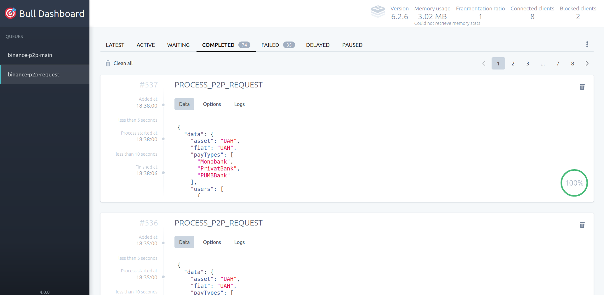

# ianus
Binance Alarms

[![Version][docker-version]][docker]
[![Downloads][docker-pulls-badge]][docker]

[![CodeFactor][codefactor-badge]][codefactor-url]
[![SonarCloud][sonarcloud-badge]][sonarcloud-url]
[![Codacy][codacy-badge]][codacy-url]
[![Scrutinizer][scrutinizer-badge]][scrutinizer-url]

[![Security][snyk-badge]][snyk-url]
[![Build Status][tests-badge]][tests-url]
[![Coverage Status][badge-coverage]][url-coverage]

[![Commit activity][commit-activity-badge]][github]
[![FOSSA][fossa-badge]][fossa-url]
[![License][badge-lic]][github]
[![Made in Ukraine][ukr-badge]][ukr-link]

## 🇺🇦 Help Ukraine
I woke up on my 26th birthday at 5 am from the blows of russian missiles. They attacked the city of Kyiv, where I live, as well as the cities in which my family and friends live. Now my country is a war zone. 

We fight for democratic values, freedom, for our future! Once again Ukrainians have to stand against evil, terror, against genocide. The outcome of this war will determine what path human history is taking from now on.

💛💙  Help Ukraine! We need your support! There are [dozen ways][ukr-link] to help us, just do it!

## Table of Contents
- [ianus](#ianus)
  - [🇺🇦 Help Ukraine](#-help-ukraine)
  - [Table of Contents](#table-of-contents)
  - [Requirements](#requirements)
  - [Installation](#installation)
  - [Usage](#usage)
    - [Administration credentials](#administration-credentials)
  - [Contribute](#contribute)

## Requirements
[![Platform Status][node-ver-test-badge]][node-ver-test-url]

To use library you need to have [node](https://nodejs.org) and [npm](https://www.npmjs.com) installed in your machine:

* node `>=10`
* npm `>=6`

Package is [continuously tested][node-ver-test-url] on darwin, linux and win32 platforms. All active and maintenance [LTS](https://nodejs.org/en/about/releases/) node releases are supported.

## Installation

Use next docker images:

```bash
  docker pull pustovitdmytro/ianus-worker
  docker pull pustovitdmytro/ianus-admin
```

## Usage

Run admin panel
```bash
  docker run -p 3000:8010 --env-file .env pustovitdmytro/ianus-admin:latest
```

Open localhost:3000

Run worker
```bash
  docker run --env-file .env pustovitdmytro/ianus-worker:latest
```

Jobs can be managed via bull dashboard:


to access dashboard, visits
```
  /admin/bull
```

to retrieve project information, check
```
  /admin/info
```

healthcheck:
```
  /admin/health
```

### Administration credentials

*User*: `admin`

*Password*: configured via `BASIC_ADMIN_PASSWORD` variable, 'password' by default.


**Note!** It is recomended to change default `BASIC_ADMIN_PASSWORD`.


## Contribute

Make the changes to the code and tests. Then commit to your branch. Be sure to follow the commit message conventions. Read [Contributing Guidelines](.github/CONTRIBUTING.md) for details.


[docker-version]: https://img.shields.io/docker/v/pustovitdmytro/ianus-worker?sort=semver
[docker-pulls-badge]: https://img.shields.io/docker/pulls/pustovitdmytro/ianus-admin
[docker]: https://hub.docker.com/repository/docker/pustovitdmytro/ianus-admin/

[github]: https://github.com/pustovitDmytro/ianus
[coveralls]: https://coveralls.io/github/pustovitDmytro/ianus?branch=master
[badge-lic]: https://img.shields.io/github/license/pustovitDmytro/ianus.svg
[badge-coverage]: https://coveralls.io/repos/github/pustovitDmytro/ianus/badge.svg?branch=master
[url-coverage]: https://coveralls.io/github/pustovitDmytro/ianus?branch=master

[snyk-badge]: https://snyk-widget.herokuapp.com/badge/npm/ianus/badge.svg
[snyk-url]: https://snyk.io/advisor/npm-package/ianus

[tests-badge]: https://img.shields.io/circleci/build/github/pustovitDmytro/ianus
[tests-url]: https://app.circleci.com/pipelines/github/pustovitDmytro/ianus

[codefactor-badge]: https://www.codefactor.io/repository/github/pustovitdmytro/ianus/badge
[codefactor-url]: https://www.codefactor.io/repository/github/pustovitdmytro/ianus

[commit-activity-badge]: https://img.shields.io/github/commit-activity/m/pustovitDmytro/ianus

[scrutinizer-badge]: https://scrutinizer-ci.com/g/pustovitDmytro/ianus/badges/quality-score.png?b=master
[scrutinizer-url]: https://scrutinizer-ci.com/g/pustovitDmytro/ianus/?branch=master

[codacy-badge]: https://app.codacy.com/project/badge/Grade/8667aa23afaa4725854f098c4b5e8890
[codacy-url]: https://www.codacy.com/gh/pustovitDmytro/ianus/dashboard?utm_source=github.com&amp;utm_medium=referral&amp;utm_content=pustovitDmytro/ianus&amp;utm_campaign=Badge_Grade

[sonarcloud-badge]: https://sonarcloud.io/api/project_badges/measure?project=pustovitDmytro_ianus&metric=alert_status
[sonarcloud-url]: https://sonarcloud.io/dashboard?id=pustovitDmytro_ianus

[npm-downloads-badge]: https://img.shields.io/npm/dw/ianus
[npm-size-badge]: https://img.shields.io/bundlephobia/min/ianus
[npm-size-url]: https://bundlephobia.com/result?p=ianus

[node-ver-test-badge]: https://github.com/pustovitDmytro/ianus/actions/workflows/npt.yml/badge.svg?branch=master
[node-ver-test-url]: https://github.com/pustovitDmytro/ianus/actions?query=workflow%3A%22Node.js+versions%22

[fossa-badge]: https://app.fossa.com/api/projects/custom%2B24828%2Fianus.svg?type=shield
[fossa-url]: https://app.fossa.com/projects/custom%2B24828%2Fianus?ref=badge_shield

[ukr-badge]: https://img.shields.io/badge/made_in-ukraine-ffd700.svg?labelColor=0057b7
[ukr-link]: https://war.ukraine.ua
